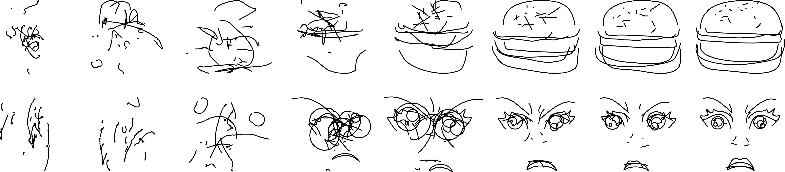
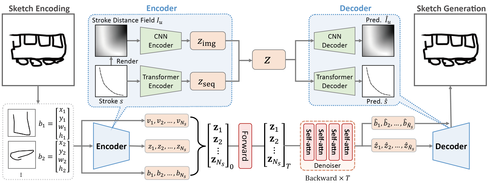

# StrokeFusion (AAAI 2026)

[](https://arxiv.org/abs/2503.23752)
[](https://doudin404.github.io/StrokeFusion-page/) []()

This repository contains the official PyTorch implementation for the paper:
> **StrokeFusion: Vector Sketch Generation via Joint Stroke-UDF Encoding and Latent Sequence Diffusion** <br>
> Jin Zhou, Yi Zhou, Hongliang Yang, Pengfei Xu, Hui Huang <br>
> *Proceedings of the AAAI Conference on Artificial Intelligence (AAAI), 2026*

## 🎨 Generation Process

StrokeFusion progressively generates highly structured and semantically coherent vector sketches through a reverse diffusion process. 

<p align="center">
  
</p>
<p align="center">
  <em><strong>Two examples of the generation process in StrokeFusion.</strong> From left to right, the noise level progressively decreases. At each timestep, only strokes with a presence confidence $\hat{v}_i > 0$ are visualized.</em>
</p>

## 🚀 Overview

In the field of sketch generation, raster-format-trained models often produce non-stroke artifacts, while vector-format-trained models typically lack a holistic understanding of sketches, resulting in compromised recognizability. 

To address these challenges, we propose **StrokeFusion**, a two-stage framework for vector sketch generation. It contains a dual-modal sketch feature learning network that maps strokes into a high-quality latent space, and a stroke-level latent diffusion model that simultaneously adjusts stroke position, scale, and trajectory during generation. This enables high-fidelity stroke generation while supporting stroke interpolation editing.

<p align="center">
  
</p>

The proposed framework comprises two core components:
1. **Dual-Modal Stroke Encoding:** Each stroke $s$ is processed through parallel encoding paths. A transformer-based sequence encoder handles geometric coordinates while a CNN processes the stroke distance field $I_n$. These modalities are fused into joint features $f$, trained via symmetric decoder networks.
2. **Sketch Diffusion Generation:** All normalized strokes are encoded into latent vectors $z_i$, augmented with bounding box parameters $b^i = [x^i, y^i, w^i, h^i]$ and presence flags $v^i \in \{-1, 1\}$. The diffusion model learns the distribution of stroke sequences through $T$-step denoising training. During generation, valid strokes are decoded through inverse normalization to reconstruct the final sketch.

## 🚀 Usage Guide

### 1. Data Preparation

First, extract your datasets and place them into the `data/raw` directory.
If you don't have the datasets yet, you can download them from the official sources or use our pre-packaged versions available on Hugging Face at **[doudin404/stroke_fusion](https://www.google.com/search?q=https://huggingface.co/doudin404/stroke_fusion)**:

* `tu_berlin.tar.gz`
* `facex.tar.gz`
* `creative.zip`

*Note: Data preprocessing will be triggered automatically at the beginning of the training script. Processed caches will be saved in `data/processed/`.*

### 2. Training the Reconstruction Model (Encoder)

Before training the diffusion model, you need to train the base DualModal reconstruction model.

Open `train.py` and adjust the `StrokesDataModule` parameters to match your target dataset:

```python
# Inside train.py
data_dir = "data/raw"            # Root directory of your dataset
save_dir = "data/processed"      # Directory for processed data cache
dm = StrokesDataModule(
    root_dir=data_dir,
    cache_dir=save_dir,
    data_name="tu_berlin",       # Name of the sub-folder/dataset (e.g., 'tu_berlin', 'facex')
    data_type="svg",             # Supported formats: 'svg', 'npz', 'json'
    path_points=64,
    gamma=200.0,
    display_scale=0.8,
    batch_size=18,               # Batch size per GPU
    num_workers=20,
)

```

Run the script to start training:

```bash
python train.py

```

*The model checkpoints will be automatically saved in the `checkpoints/` directory.*

### 3. Training the Generative Diffusion Model

Once the reconstruction model is trained, you can train the latent diffusion model.

Open `train_diff.py`. Ensure that the `SketchsDataModule` parameters are strictly consistent with the ones used in Step 2. Then, pass your trained checkpoint from Step 2 as the `encoder_ckpt`:

```python
# Inside train_diff.py
# Load the pre-trained DualModalModel to serve as the encoder
encoder_ckpt = "checkpoints/ready/best_tu_berlin.ckpt"
encoder_model = DualModalModel.load_from_checkpoint(encoder_ckpt).eval()

```

Run the script to start training the diffusion model:

```bash
python train_diff.py

```

### 4. Sampling & Generation

To generate new sketches or reconstruct existing ones, use the `sample.py` script.

Open `sample.py` and modify the `sample_configs` dictionary to set your desired generation parameters:

```python
# Inside sample.py
sample_configs = {
    # Options: "tu_berlin", "facex", "creative_birds", "creative_creatures", etc.
    "data_name": "facex",  
    "prefix": "",                # Prefix path for saving results (e.g., "quick_draw/")
    "mode": "random",            # Selection: "dataset", "recon" (reconstruction), or "random"
    "device": "cuda:0",          # Target computation device
    "num_samples": 256,          # Total number of samples to generate (e.g., 64 * 4)
    "max_len": 32,               # Maximum sequence length
    "flip_vertical": False,      # Vertical flip toggle (set True for tu_berlin/facex)
    "color": False,              # Color rendering toggle
    "cond": None,                # Value for conditional sampling (None for unconditional)
}

```

Run the sampling script:

```bash
python sample.py

```

*All generated visualizations and latent encodings will be exported to the `sample/` directory automatically based on your selected mode.*